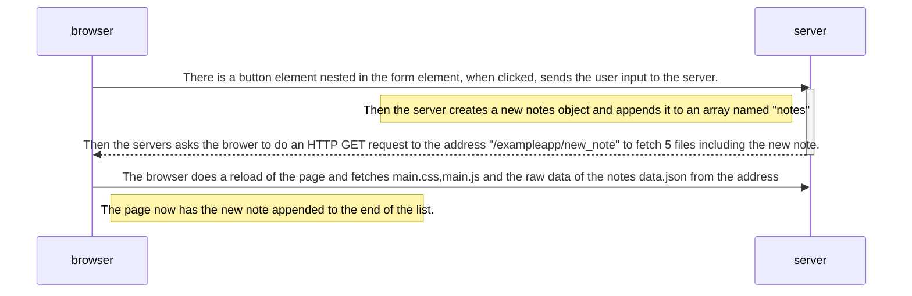

```mermaid
    sequenceDiagram
        participant browser
        participant server

        browser->>server: There is a button element nested in the form element, when clicked, sends the user input to the server.
        activate server

        Note left of server:Then the server creates a new notes object and appends it to an array named "notes"

        server-->>browser: Then the servers asks the brower to do an HTTP GET request to the address "/exampleapp/new_note" to fetch 5 files including the new note.
        deactivate server

        browser->>server: The browser does a reload of the page and fetches main.css,main.js and the raw data of the notes data.json from the address

        Note right of browser: The page now has the new note appended to the end of the list.
```
