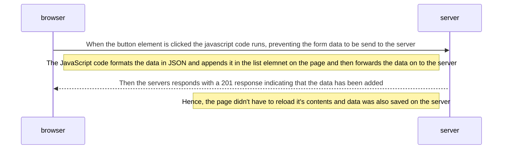

```mermaid
    sequenceDiagram
        participant browser
        participant server
        
        browser->>server: When the button element is clicked the javascript code runs, preventing the form data to be send to the server
        activate server
        
        Note right of browser: The JavaScript code formats the data in JSON and appends it in the list elemnet on the page and then forwards the data on to the server

        server-->>browser: Then the servers responds with a 201 response indicating that the data has been added

        Note left of server: Hence, the page didn't have to reload it's contents and data was also saved on the server
```