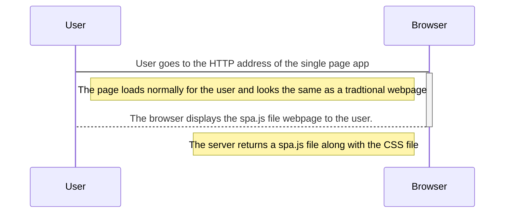

```mermaid
    sequenceDiagram
        participant User
        participant Browser

        User->Browser: User goes to the HTTP address of the single page app
        activate Browser

        Note right of User: The page loads normally for the user and looks the same as a tradtional webpage

        Browser-->User: The browser displays the spa.js file webpage to the user.
        deactivate Browser

        Note left of Browser: The server returns a spa.js file along with the CSS file
```
